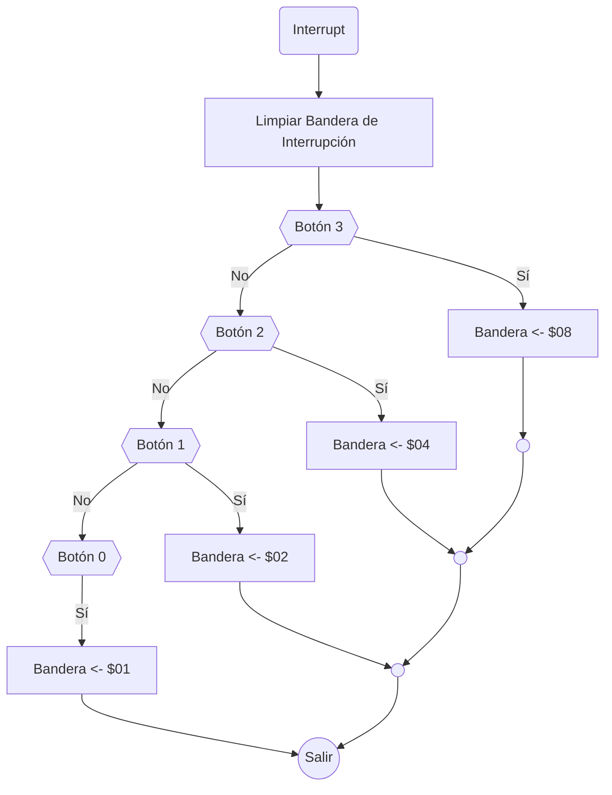

## Diagrama de Flujo de Rutina de Interrupción

```mermaid
graph TD
    A(Interrupt) -->B[Limpiar Bandera de Interrupción]
    B --> C{{ Botón 3 }}
    C --> |Sí|D[Bandera <- $08] --> E(( ))
    C --> |No|F{{ Botón 2}}
    F --> |Sí|G[Bandera <- $04] --> H(( ))
    F --> |No|I{{ Botón 1 }}  
    I --> |Sí|K[Bandera <- $02] --> J(( ))
    I --> |No|L{{ Botón 0}}
    L --> |Sí|M[Bandera <- $01] --> Z((Salir))

    E -->H-->J-->Z
```     
