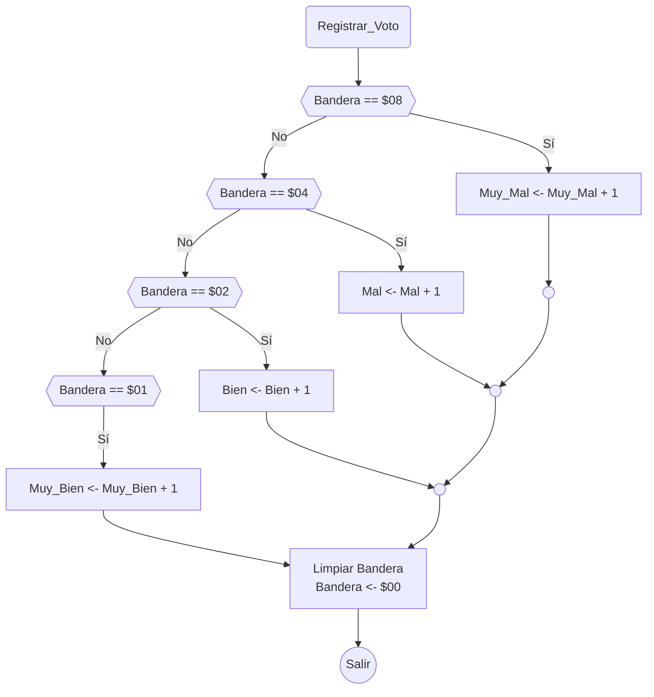

# Diagrama de Flujo De subrutina para contabilizar votos

```mermaid
graph TD
    A(Registrar_Voto) 
    A --> C{{ Bandera == $08 }}
    C --> |Sí|D[Muy_Mal <- Muy_Mal + 1] --> E(( ))
    C --> |No|F{{ Bandera == $04 }}
    F --> |Sí|G[Mal <- Mal + 1] --> H(( ))
    F --> |No|I{{ Bandera == $02 }}  
    I --> |Sí|K[Bien <- Bien + 1] --> J(( ))
    I --> |No|L{{ Bandera == $01 }}
    L --> |Sí|M[Muy_Bien <- Muy_Bien + 1] --> N[Limpiar Bandera <br /> Bandera <- $00] 

    E -->H-->J-->N --> Z((Salir))
```    
