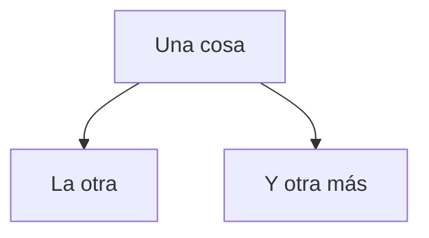

# Cajita tropical

Una máquina para recopilar sondeos de opinión de personas usuarias en diversos contextos, como ferias del agricultor y transporte público. Parte del TCU "Tropicalización de la tecnología".

