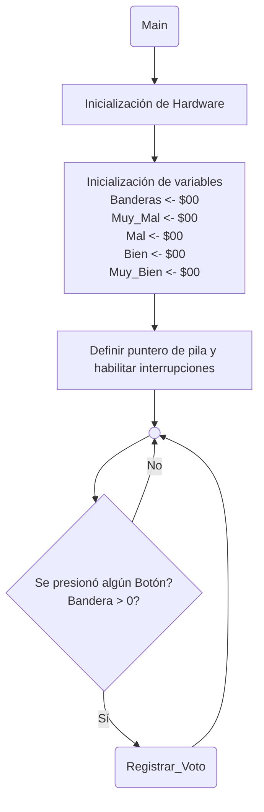

#Programa principal

```mermaid
graph TD
    A(Main) -->B[Inicialización de Hardware]
    B --> C[Inicialización de variables <br /> Banderas <- $00 <br /> Muy_Mal <- $00 <br /> Mal <- $00 <br /> Bien <- $00 <br /> Muy_Bien <- $00]
    C -->D[Definir puntero de pila y habilitar interrupciones]
    D --> E(( ))
    E --> F{Se presionó algún Botón? <br /> Bandera > 0?}
    F --> |No| E
    F --> |Sí| G(Registrar_Voto)
    G --> E
```
  
